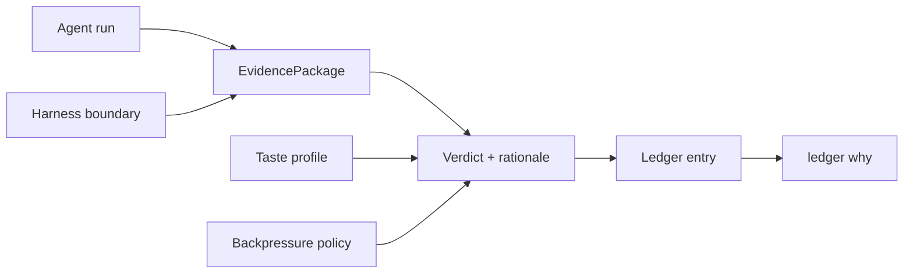

# Architecture

High-level map of the outerloop monorepo. For schemas, CLI design, and implementation detail, see [SPEC.md](../SPEC.md).

## Data flow



## Packages

| Package | Responsibility | Status |
|---------|----------------|--------|
| `@cobusgreyling/outerloop-core` | Zod schemas, types, paths, EvidencePackage builder | ✅ |
| `@cobusgreyling/outerloop` | CLI entrypoint (`outerloop`) | ✅ |
| `evidence` | Generators, normalizers, risk scorers | ✅ |
| `verdict` | Review TUI, decision recorder | ✅ |
| `ledger` | Storage, query, provenance reconstruction | ✅ |
| `taste` | Capture, versioning, rule matching | ✅ |
| `policy` | Backpressure DSL parser and enforcer | ✅ |
| `harness` | Boundary spec parser and validator | ✅ |
| `cognitive` | Debt estimators, narrative generators | ✅ |
| `integrate` | loop-engineering, Cursor, GitHub adapters | ✅ |
| `attention` | Pending verdict routing | ✅ |
| `brownfield` | Legacy codebase introspection | ✅ |
| `audit` | Governance health scoring | ✅ |
| `dashboard` | Text, Ink TUI, web views | ✅ |
| `coordination` | Multi-loop registry | ✅ |

## On-disk layout

Projects initialized with `outerloop init` store artifacts under `.outerloop/`:

```
.outerloop/
├── evidence/
├── verdicts/
├── ledger/
├── manifests/
├── harness/
├── policy/
├── taste/
└── coordination/
```

## Monorepo tooling

- **pnpm workspaces** — `packages/*`
- **Turborepo** — `build`, `test`, `dev` pipelines
- **Changesets** — versioned npm releases for `@cobusgreyling/outerloop`

## Package map (all modules)

See the full table in this file's [Packages](#packages) section above. The README intentionally omits the 14-package breakdown — start with [concepts.md](./concepts.md) instead.

## Further reading

- [concepts.md](./concepts.md) — 5-minute concept guide
- [cli.md](./cli.md) — command reference
- [api.md](./api.md) — programmatic integration
- [QUICKSTART.md](../QUICKSTART.md) — try the CLI in five minutes
- [adopting.md](./adopting.md) — add outerloop to your repo
- [SPEC.md](../SPEC.md) — full specification